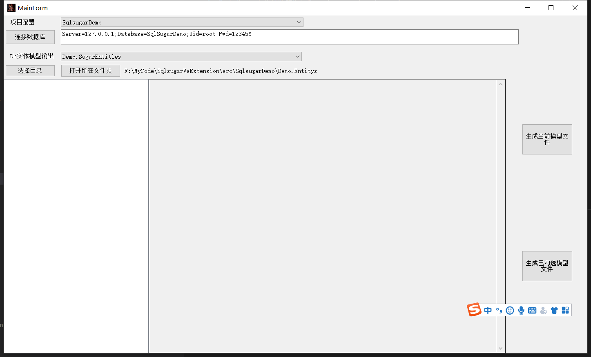
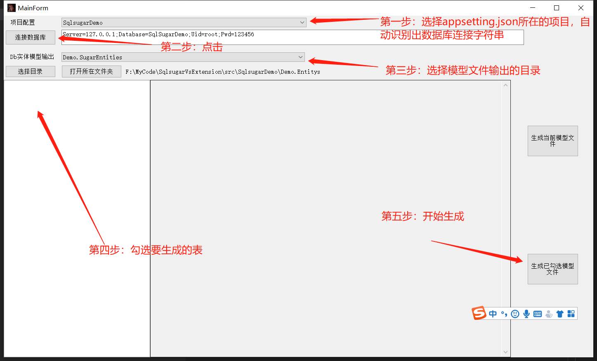

# SqlsugarVs扩展插件

#### 介绍
Vs插件，用来生成Sqlsugar模型

#### 软件架构
软件架构说明

#### 安装教程

* 方式一：下载最新的发行版 SqlsugarExtension.vsix
  https://gitee.com/shuangfanguang/SqlsugarVsExtension/releases  

* 方式二：在visual studio的扩展中，搜索SqlsugarExtension，进行安装

#### 使用说明

* 扩展安装完毕后，会出现在visual studio`菜单栏`->`扩展`->`自用插件`->`Sqlsugar模型生成` 
* 点击后，会出现图形界面   

* 依次操作

